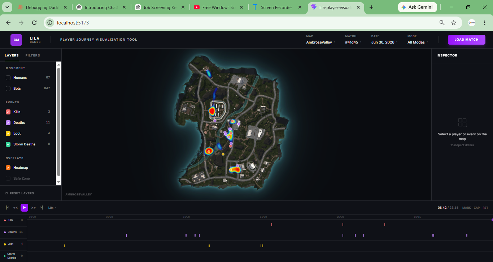
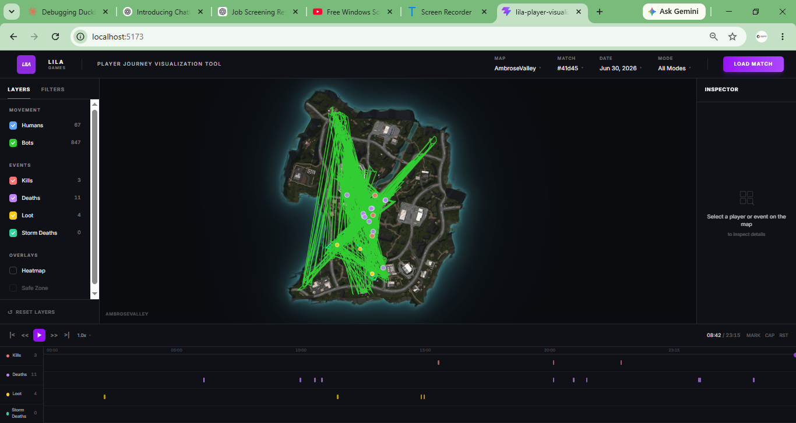
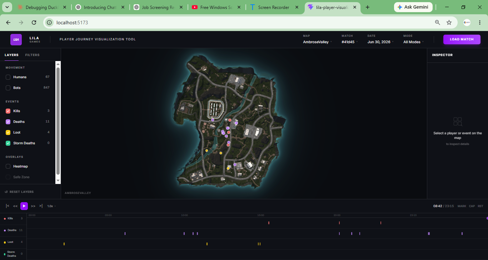

# Insights

This document summarizes a few observations I made while exploring the gameplay data using the visualization tool.

---

# Insight 1 - Players gather around a few key locations

### What caught my eye

The heatmap shows that players are not spread evenly across the map. Most activity happens around a few locations while large parts of the map remain relatively quiet.

### Evidence

The hotspots clearly show where player activity is concentrated.

### Actionable item

These high-traffic areas can be reviewed to understand why players prefer them. If the goal is to encourage exploration, loot placement or map layout can be adjusted to make quieter areas more attractive.

### Why a level designer should care

Understanding where players naturally spend their time helps identify overused and underused areas of the map.

---

# Insight 2 - Players naturally follow similar routes

### What caught my eye

The replay shows that movement is not random. Players tend to follow similar paths before reaching combat areas.

### Evidence

The movement visualization highlights common travel routes across the level.

### Actionable item

These routes can be reviewed for possible choke points, better cover placement, or additional route options to improve gameplay flow.

### Why a level designer should care

Player movement is one of the best indicators of how a level is actually being used, which is often different from the original design intention.

---

# Insight 3 - Combining replay with events gives better context

### What caught my eye

Looking at kills or loot markers alone only shows where something happened. Watching the replay together with the timeline makes it much easier to understand how players reached those locations.

### Evidence

The replay provides the sequence of player movement before combat and loot events occur.

### Actionable item

Using replay together with event markers helps investigate player behaviour, rotations, and engagement timing instead of looking at isolated events.

### Why a level designer should care

Understanding what players did before a fight provides much better insight for balancing encounters, adjusting level flow, and improving overall gameplay experience.